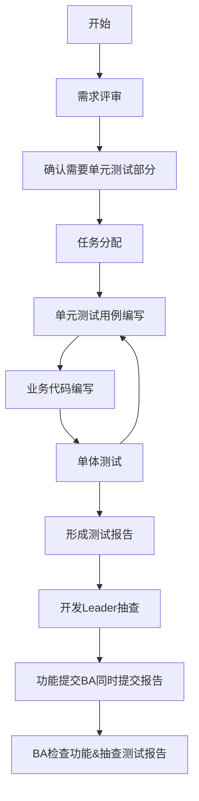

---
{"dg-publish":true,"dg-permalink":"/ObPublish/OP1666003116","permalink":"/ObPublish/OP1666003116/","dgHomeLink":true,"dgPassFrontmatter":false,"dgShowBacklinks":false,"dgShowLocalGraph":false,"dgShowInlineTitle":false}
---

---
*citation*:: 
*refrence*:: 
*relation*:: 